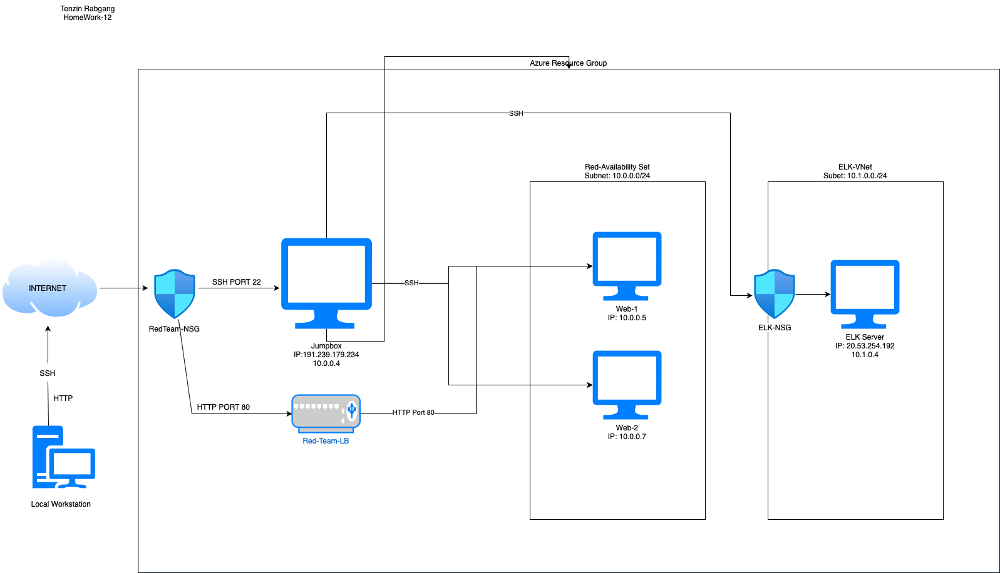
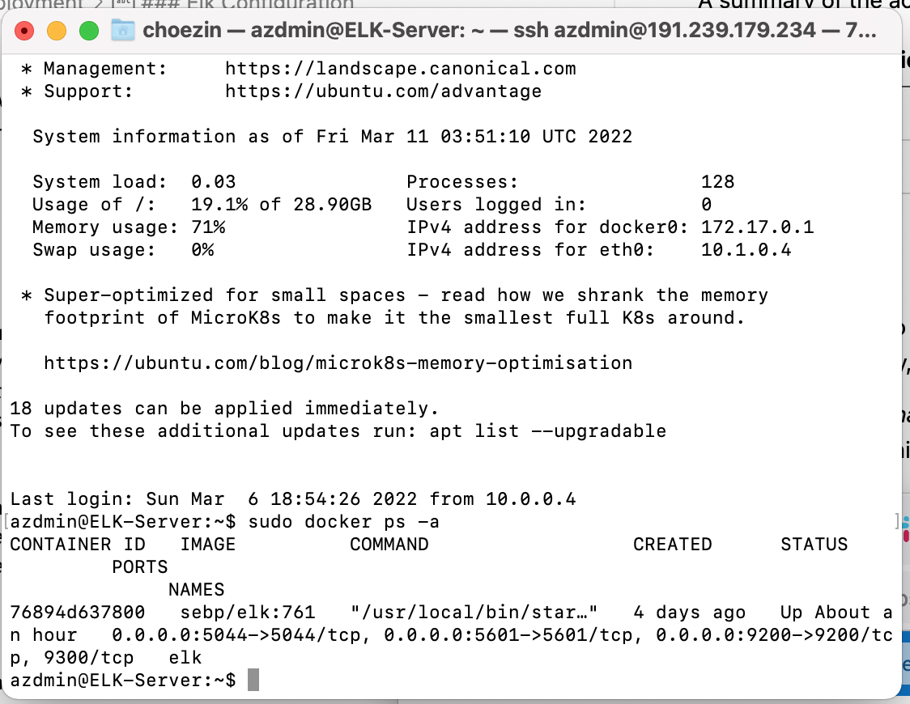
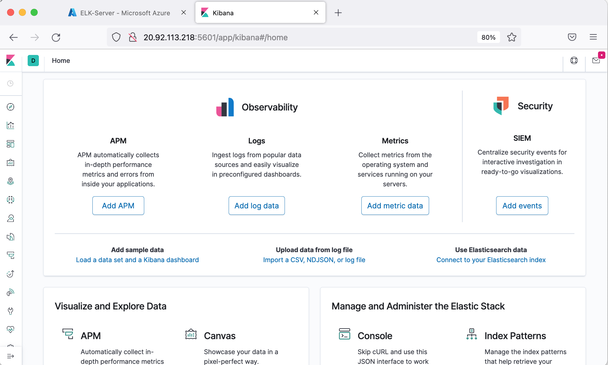
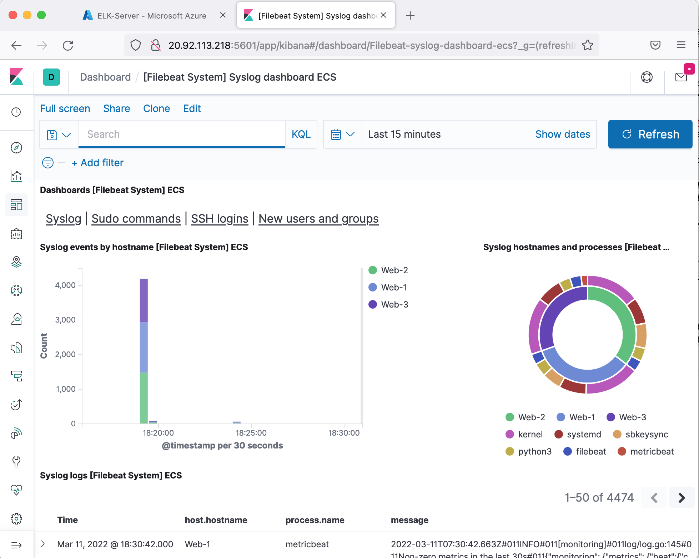

## Automated ELK Stack Deployment

The files in this repository were used to configure the network depicted below.

These files have been tested and used to generate a live ELK deployment on Azure. They can be used to either recreate the entire deployment pictured above. Alternatively, select portions of the `yaml` file may be used to install only certain pieces of it, such as Filebeat.

  - [pentest.yml](ansible/pentest.yml)

This document contains the following details:
- Description of the Topologu
- Access Policies
- ELK Configuration
  - Beats in Use
  - Machines Being Monitored
- How to Use the Ansible Build

### Description of the Topology

The main purpose of this network is to expose a load-balanced and monitored instance of DVWA, the D*mn Vulnerable Web Application.

Load balancing ensures that the application will be highly `redundant`, in addition to restricting `congestion` to the network.
- _What aspect of security do load balancers protect? What is the advantage of a jump box?_
  - Load balancers protect the availability of the servers. The advantage of a jumpbox is to make sure that no one can SSH directly into the web servers. It reduces the number of attack vectors on the network.

Integrating an ELK server allows users to easily monitor the vulnerable VMs for changes to the `configurations` and system `files and logs`.
- _What does Filebeat watch for?_
  - The filebeat watches for sudo commands, ssh logins, and account linux logins.
- _What does Metricbeat record?_
  - Metricbeat watches for the CPU, RAM, and network usage.

The configuration details of each machine may be found below.
_Note: Use the [Markdown Table Generator](http://www.tablesgenerator.com/markdown_tables) to add/remove values from the table_.

| Name     | Function | IP Address | Operating System |
|----------|----------|------------|------------------|
| Jump Box | Gateway  | 10.0.0.4   | Linux            |
| Web-1     |   Web Server       | 10.0.0.5           |                  |
| Web-2    | Web-Server         |            |                  |
| Elk-Server    |Logging Server      |            |                  |

### Access Policies

The machines on the internal network are not exposed to the public Internet. 

Only the `jumpbox` and `web server` machine can accept connections from the Internet. Access to this machine is only allowed from the following IP addresses:
- Jumpbox can only be accessed by my personal IP due to whitelisted IP in firewall settings.
- Webservers can be accessed via HTTP through the load balancers.

Machines within the network can only be accessed by `Jumpbox`.
- _Which machine did you allow to access your ELK VM? What was its IP address?_
  - We allowed only the Jumpbox to be accessed via SSH. The IP of the Jumpbox is 10.0.0.4.

A summary of the access policies in place can be found in the table below.

| Name     | Publicly Accessible | Allowed IP Addresses |
|----------|---------------------|----------------------|
| Jump Box | Yes         | Personal Home IP   |
| Web-1         |     Yes                |           Any           |
| Web-2    |          Yes           |                 Any     |

### Elk Configuration

Ansible was used to automate configuration of the ELK machine. No configuration was performed manually, which is advantageous because...
- _What is the main advantage of automating configuration with Ansible?_
  - The main advantage of Ansible is faster deployment and prone to less human errors.

The playbook implements the following tasks:
- _TODO: In 3-5 bullets, explain the steps of the ELK installation play. E.g., install Docker; download image; etc._
- ...
- ...

The following screenshot displays the result of running `docker ps` after successfully configuring the ELK instance.

### Target Machines & Beats
This ELK server is configured to monitor the following machines:

List the IP addresses of the machines you are monitoring
- Jobox-Provisioner: 91.239.179.234
- Web-1: 10.0.0.5
- Web-2: 10.0.0.7
- Web-3: 10.0.0.8

We have installed the following Beats on these machines:
- Web1, Web2, Web3, ELK-Server
    - Filebeat
    - Metricbeat 

These Beats allow us to collect the following information from each machine:

- The filebeat allows us to collect system types such as watches for sudo commands, ssh logins, and account linux logins to check loging activities.

- Metricbeat collects useful data such as the CPU, RAM, and network usages.

### Using the Playbook
In order to use the playbook, you will need to have an Ansible control node already configured. Assuming you have such a control node provisioned: 

SSH into the control node and follow the steps below:
- *Copy the elk_install.yml file to /etc/ansible/roles/elk_install.yml*
- *Update the hosts file to include...*
- *Run the playbook, and navigate to http://[your_elk_server_ip]:5601/app/kibana to check that the installation worked as expected.

 _Answer the following questions to fill in the blanks:_
- _Which file is the playbook? Where do you copy it?_
- _Which file do you update to make Ansible run the playbook on a specific machine? How do I specify which machine to install the ELK server on versus which to install Filebeat on?_
- _Which URL do you navigate to in order to check that the ELK server is running?

_As a **Bonus**, provide the specific commands the user will need to run to download the playbook, update the files, etc._

To run playbook, we need to run the curl command below on Jump Box
    
    - ansible-playbook/etc/ansible/roles/elk_install.yml
    - check the installtion status by browsing http://[your-elk-server-ip]:5601/app/kibana
    

 - 

Installing Filebeats:

- Download and run the given playbook curl: curl -L -O https://artifacts.elastic.co/downloads/beats/metricbeat/metricbeat-7.6.1-amd64.deb

- Run the playbook with: ansible-playbook /etc/ansible/roles/filebeat_playbook.yml

 - 